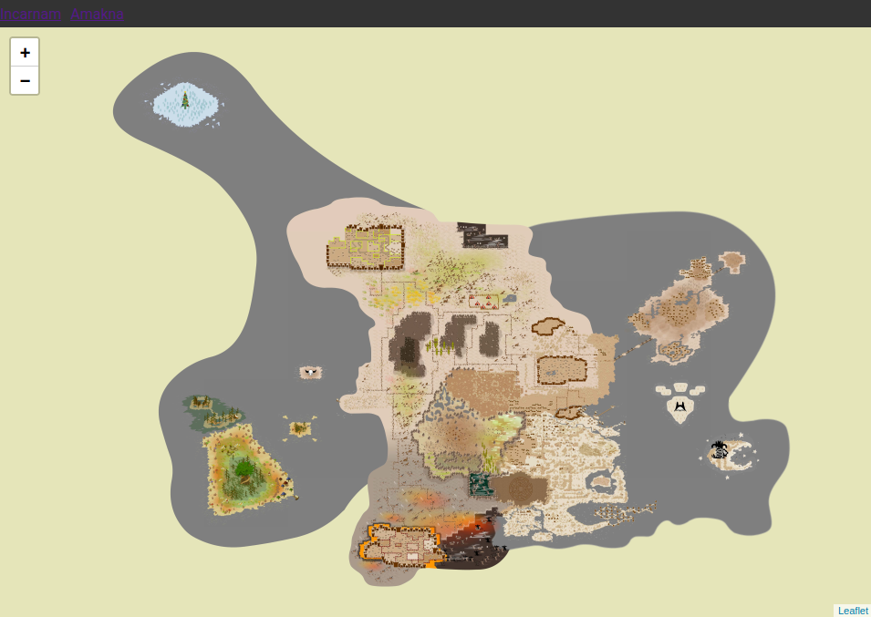
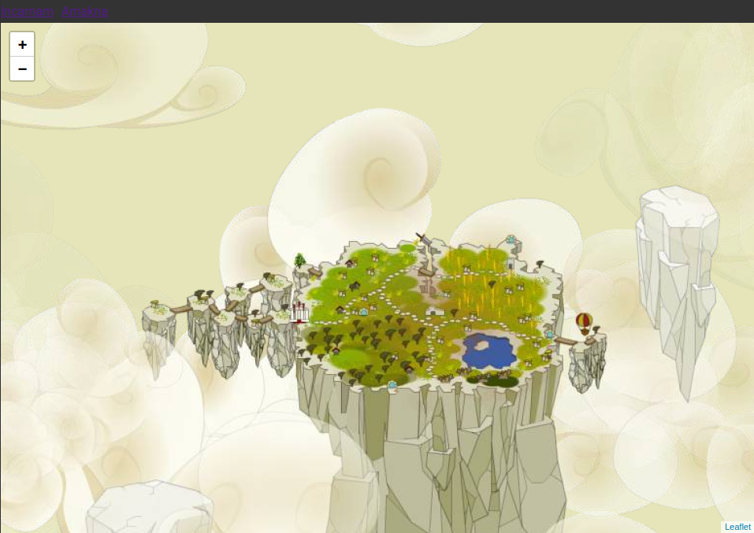
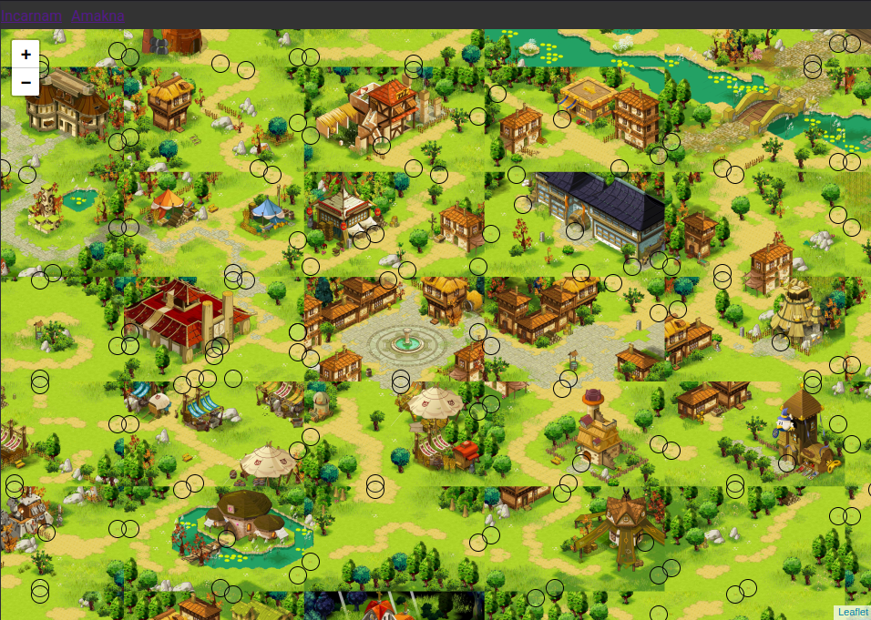
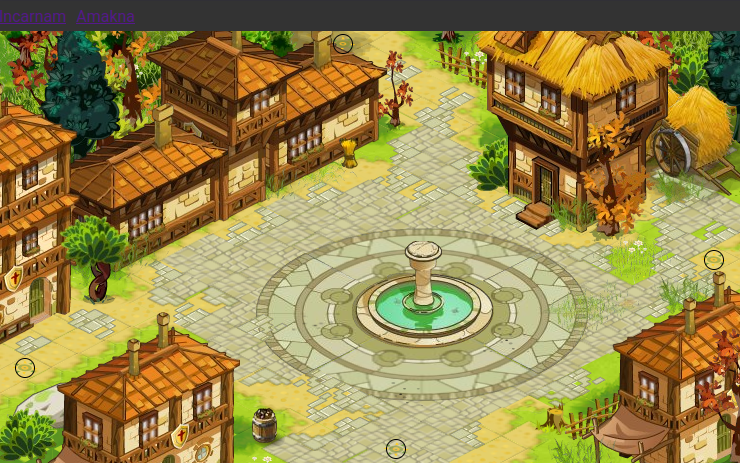

# WorldMap Viewer

This example provides a simple application with:
- Incarnam and Amakna worldmap viewer using Leaflet.js
- Shows teleportation cells on maps
- Display a single map

It uses database from [Araknemu](https://github.com/Arakne/Araknemu).

## Installation (using docker)

Retrieve all necessary assets:
- Setup the araknemu database
- Download and extract the Dofus 1.29 client
- Download and extract the dofus maps

Configure the `.env`:

```bash
# Configure the DB connection to your araknemu database
# Don't forget that the database must be accessible from the docker container
DB_DSN=mysql:host=172.17.0.1;dbname=araknemu
DB_USER=araknemu
DB_PASSWORD=araknemu

# Do not change paths: they are mounted from the host to the container
DOFUS_PATH=/srv/data/dofus
MAPS_PATH=/srv/data/maps

# Docker allows to bind ports from the host to the container
# So port 80 is fine in this case
LISTEN_PORT=80

# Number of worker processes
# Consider setting this to the number of CPU cores you have on small traffics
# Or the double on high traffics
# Note: higher number of workers means more memory usage (one process = ~200MB)
WORKER_COUNT=8
```

Create a `docker-compose.override.yml` file:

```yaml
services:
    php:
        restart: unless-stopped
        
        # Map the dofus client and maps from the host to the container
        # Also keep the cache as persistent volume, so it will not be rebuilt at each container restart
        volumes:
            - ./dofus/client/path:/srv/data/dofus:ro
            - ./dofus/maps/path:/srv/data/maps:ro
            - ./cache:/srv/cache
```

Now you can build and start the container:

```bash
docker-compose build
docker-compose up -d
```

To optimise the cache, you can pre-generate the map tiles:

```bash
docker-compose exec php php index.php warmup
```

> [!NOTE]
> The `exec` command runs a command inside the running container, so make sure the container is running before executing it.
> Use `run` instead of `exec` if you want to run it in a new container.

You can now access the application at [http://127.0.0.1:5000/](http://127.0.0.1:5000/) (or your server IP if not running locally).

## Screenshot





